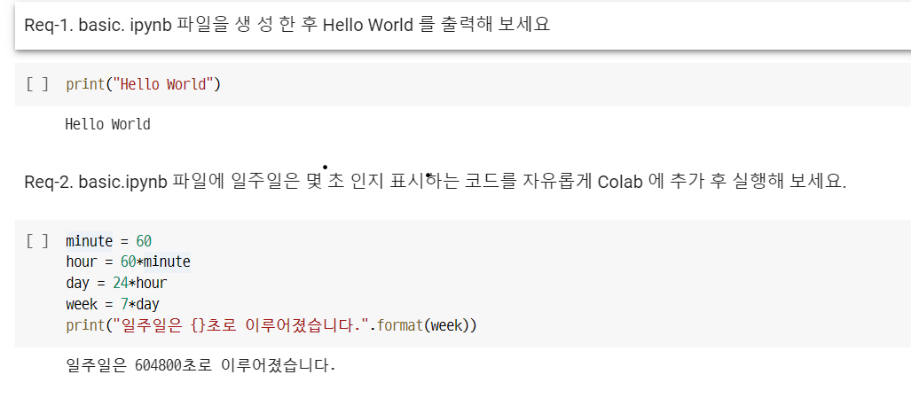
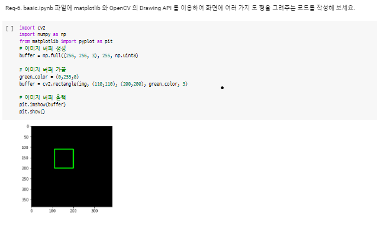
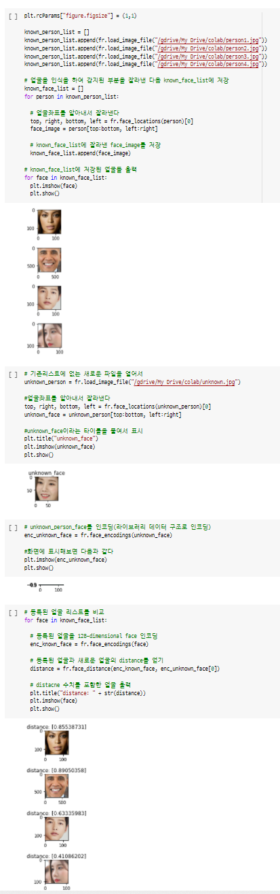

# 인공지능 기본개념 학습: Google Colab기반 얼굴인식 README

[TOC]

---


## 본 프로젝트에 필요한 요구사항 정의

`얼굴인식 기능을 갖춘 기본적인 라이브러리 활용 및 코드 이해를 돕고자 본 프로젝트에 들어가기 앞서 필요한 기술과 개념들을 정리해 놓았습니다.`


### 본 프로젝트의 목표

- Google Colab의 기본적인 사용법 숙지
- Python 코드를 GPU 가속을 적용해 실행 및 Google Drive와 연동해 수행결과를 읽고 쓸 줄 아는 역량 습득
- OpenCV 라이브러리 파악, OpenCV API를 사용해 이미지 처리를 하는 기본적인 이미지 데이터 처리방식을 익힙니다.
- 얼굴인식과 관련된 패키지 중 가장 기본적인 face_recognition 패키지를 사용해 얼굴인식 기능을 개발해 보는 경험을 습득
- 기존에 몰랐던 새로운 라이브러리 / 패키지를 래퍼런스 문서(참고 명세서 및 오픈소스)를 보고 적용하는 방법을 경험


### 필요 기술(기본 요구사항)

#### Google Colab

- 기존 Python 학습을 위해 사용했던 `Jupyter Notebook`에 대한 기본적인 개념  및 이용법 필요
- 위 `Jupyter Notebook`에 `Colab`을 통해 Python 소스코드를 추가 가능 및 소스코드나 데이터를 Google Drive를 통해 불러오거나 저장 가능.
- `Colab`은 위를 가능하게 해주는 Google 클라우드 컴퓨팅 환경안의 개발환경이다.

#### Dib 기반의 face-recognition 1.3.0 패키지

- 해당 패키지는 얼굴 감지(Face Detection)와 얼굴 인식(Face Recognition)을 가능하게 해준다.
  - `Face Detection`: 사진에서 얼굴을 찾아내 얼굴이 표시된 영역을 알아내는 기술
  - `Face Recogntion`: 감지된 얼굴데이터를 기반으로 동일한 인물을 찾아내 인식하는 기술
- `패키지 참조 링크`
  - [pypi.org](https://pypi.org/project/face-recognition/)
  - [github](https://github.com/ageitgey/face_recognition)


### 세부 필요기술(세부 요구사항)

#### Google Colab

- [학습 참조 링크](https://colab.research.google.com/)
- `ipynb 파일`: IPYNB 파일은 과학자들이 파이썬 언어와 데이터로 작업 할 수 있도록 도와주는 인터랙티브 한 계산 환경 인 Jupyter Notebook에서 사용하는 노트 문서입니다. 계산, 수학, 이미지 및 설명 텍스트의 입력과 출력을 포함하는 Jupyter Notebook 웹 응용 프로그램 세션의 모든 내용이 포함되어 있습니다. IPYNB 파일은 .HTML, .PDF, reStructuredText 및 LaTeX 형식으로 내보낼 수 있습니다.

- `코드 스니펫(Code Snippet)`: **스니펫**(snippet)은 재사용 가능한 소스코드, 기계어, 텍스트의 작은 부분을 일컫는 프로그래밍 용어이다. 사용자가 루틴 편집 조작 중 반복 타이핑을 회피할 수 있게 도와준다.
- `GPU`: 컴퓨터 그래픽을 처리하는 장치로, 그래픽 카드를 구성하는 가장 중요한 핵심 요소
- `TPU`: Tensor Processing Unit의 약자, 구글에서 2016년 5월에 발표한 데이터 분석 및 딥러닝용 하드웨어이다. 8비트 정수 연산을 활용해 벡터/행렬연산의 병렬처리에 특화되어있다.
- `OpenCV 라이브러리`: **실시간** 이미지 프로세싱에 중점을 둔 라이브러리

#### face-recognition 1.3.0 패키지

- `HOG (Histogram of Oriented Gradients) Algorithm`: HOG Algorithm은 일반적으로 **보행자 검출이나 사람의 형태에 대한 검출** 즉, **Object Tracking**에 많이 사용되는 Feature 중 하나이다. **Image의 지역적인 Gradient를 해당 영상의 특징으로 사용**하는 방법이다.


---


## 얼굴 인식 기능 프로젝트 테스트(Test-Case)

`얼굴인식 기능을 갖춘 코드 완성 후 정상적으로 작동하는지, 혹은 문제점이 없는지 테스트 하기 위한 계획`


### Google Colab 기능 테스트

- Google Drive와 ipynb 파일 Colab 연결여부 확인
  - 제공된 basic.ipynb 파일상에서 Hello World 출력해 보기.

  - basic.ipynb 파일에 원하는 코드를 자유롭게 Colab에 추가 해 실행해 보기
    - ex) 일년은 몇일인지 표시하는 코드 작성 후 실행

- Google Colab의 코드 스니펫 기능 확인

  - basic.ipynb 파일에 Colab의 코드 스니펫 창에 코드를 추가해 실행해 보기
    - Visualization: Linked Brushing in Altair
    - Camer Capture를 추가해 본인의 얼굴 찍어보기.
    - 추가로 1개의 코드 스니펫을 자유롭게 선택하여 올려 놓기
    - 실행결과 저장

- Google Colab - Google Drive 연동 확인

  - basic.ipynb 파일에 Google Drive 연동을 하는 코드를 추가하고 본인의 구글 드라이브에 임의의 텍스트 파일을 저장하는 코드 작성해 보기.
  - 코드 스니펫의 Mounting Google Drive in your VM 사용 가능

- Colab에서 GPU / TPU 사용
  - GPU 가속 예제코드를 실행해 보고 CPU 사용시 처리시간과 GPU 사용시 처리시간을 비교
  - 마지막 블럭인 **Observe TensorFlow speedup on GPU relative to CPU** 결과를 복사해서 basic.ipynb에 텍스트 형태로 붙여주기.
- OpenCV 라이브러리 기능 확인
  - basic.ipynb 파일에 matplotlib과 OpenCV의 Drawing API를 이용해, 화면에 여러가지 도형을 그려주는 코드 작성해보기.


### 얼굴감지와 얼굴인식 기능 구현 후 기능 테스트

- 얼굴 감지(Face Detection) 테스트
  - 다수의 사람들이 포함된 이미지 파일을 Google Drive에 업로드
  - 성공적인 테스트를 위해, 각각의 얼굴이 뚜렷히 나온 연예인 그룹 인물 사진을 추천
  - 내가 좋아하는 연예인 그룹의 인물촬영 사진을 넣어보자.
    - 레드벨벳, 아이즈원 등.
  - face_recognition 패캐지의 기본 HOG 모델을 사용해 감지한 얼굴에 초록색 사각형이 잘 그려지는지 확인
- 얼굴 인식(Face Recognition) 테스트
  - 다른 인물 사진 몇장과 동일인물 사진 몇장을 준비한다.
  - 위 인물 사진 중 4명의 얼굴 사진에서 얼굴을 감지한 후 해당영역을 face_encoding()하여 보관한다.
  - 이후 새로운 인물사진 unknown을 입력 받아 기존 4명의 얼굴 중 동일인을 찾는 코드를 advanced.ipynb에 추가 후 실행.
  - 동일 인물끼리 distance 값이 0.5 이하가 나오는지 확인.(0.6 이상은 타인으로 분류)

---


## 얼굴인식 프로젝트 구현 과정 및 결과물

### 기초단계(Basic)

`기초단계에서는 Google Colab 연동과 Google Colab 라이브러리를 활용하는 법을 학습했다.`



- Google Colab 상에서 기본적인 코드를 작성해 잘 작동하는지 확인해봤다.
- 언어는 Python 기반이라 코드를 짜는데 크게 어려움은 없었다.


- 다음은 Colab의 `Code Snippet(재활용 코드)` 중에 `Visualization: Linked Brushing in Altair`를 사용해봤다. 우선 data에서 더미 데이터를 가져오고 이 데이터를 시각자료(그래프)로 변환시켜준다.
- 코드를 보면 x축과 y축, 그래프에 표시되는 데이터들의 형식, 색깔 까지 내가 코드를 수정해 원하는데로 표현할 수 있다.


- 다음으로는 `Camera Capture`라이브러리를 이용해 나의 사진을 찍어보았다.
- 상태가 좋지못해서 모자이크 처리했다.ㅎㅎ!




- 이미지 버퍼에 직접 사각형을 그려주어 출력도 해보았다.
- 후에 인물 사진 속 인식된 얼굴에 사각형을 그려주기 위한 연습이다.

---

### 심화단계(Advanced)

`이미지 업로드를 위해 Google Drive에 연동 후 'face_recognition' 라이브러리를 활용해 'Face Detection'과 'Face Recognition'을 할 수 있는 코드를 짜봤다.`

#### Face Detection


- 위와 같이 사진속에 얼굴이라고 인식되는 곳은 cv2를 활용해 사각형을 그려주었다.
- `face_recogtion`이라는 라이브러리에 `load_image_file`과 `face_locations`라는 함수가 있는데 이는 뒤에서 더 깊게 파헤쳐 볼 거다.


#### Face Recognition



- 우선 비교 대상이 되는 인물 4명의 얼굴 사진만 잘라준 후 리스트에 넣어준다. 추가적으로 비교하고 싶은 'unknown'  의 얼굴 사진도 잘라준다. 그 후 각각의 사진들을 `face_recogtion`라이브러리의 `encodings` 를 이용해 라이브러리가 저장하고 비교할 수 있는 데이터 구조로 변환해준다.
- 이렇게 변환된 데이터을 `face_distace`함수를 이용해 `distance` 값을 계산해준다.
- 통상적으로 `distance`값이 0.6 이상이면 다른 인물, 0.5이하면 동일 인물로 간주된다.

---


## 'face_recognition' 라이브러리의 함수들 파헤치기

- [`face_recogntion 패키지` Github 공식문서(참조링크)](https://github.com/ageitgey/face_recognition)

### load_image_file

```python
def load_image_file(file, mode='RGB'):
    """
    Loads an image file (.jpg, .png, etc) into a numpy array
    :param file: image file name or file object to load
    :param mode: format to convert the image to. Only 'RGB' (8-bit RGB, 3 channels) and       'L' (black and white) are supported.
    :return: image contents as numpy array
    """
    im = PIL.Image.open(file)
    if mode:
        im = im.convert(mode)
    return np.array(im)
```


### face_locations

```python
def face_locations(img, number_of_times_to_upsample=1, model="hog"):
    """
    Returns an array of bounding boxes of human faces in a image
    :param img: An image (as a numpy array)
    :param number_of_times_to_upsample: How many times to upsample the image looking for faces. Higher numbers find smaller faces.
    :param model: Which face detection model to use. "hog" is less accurate but faster on CPUs. "cnn" is a more accurate
                  deep-learning model which is GPU/CUDA accelerated (if available). The default is "hog".
    :return: A list of tuples of found face locations in css (top, right, bottom, left) order
    """
    if model == "cnn":
        return [_trim_css_to_bounds(_rect_to_css(face.rect), img.shape) for face in _raw_face_locations(img, number_of_times_to_upsample, "cnn")]
    else:
        return [_trim_css_to_bounds(_rect_to_css(face), img.shape) for face in _raw_face_locations(img, number_of_times_to_upsample, model)]
 

########################################################################################


def _trim_css_to_bounds(css, image_shape):
    """
    Make sure a tuple in (top, right, bottom, left) order is within the bounds of the image.
    :param css:  plain tuple representation of the rect in (top, right, bottom, left) order
    :param image_shape: numpy shape of the image array
    :return: a trimmed plain tuple representation of the rect in (top, right, bottom, left) order
    """
    return max(css[0], 0), min(css[1], image_shape[1]), min(css[2], image_shape[0]), max(css[3], 0)


def _rect_to_css(rect):
    """
    Convert a dlib 'rect' object to a plain tuple in (top, right, bottom, left) order
    :param rect: a dlib 'rect' object
    :return: a plain tuple representation of the rect in (top, right, bottom, left) order
    """
    return rect.top(), rect.right(), rect.bottom(), rect.left()
    
    
def _raw_face_locations(img, number_of_times_to_upsample=1, model="hog"):
    """
    Returns an array of bounding boxes of human faces in a image
    :param img: An image (as a numpy array)
    :param number_of_times_to_upsample: How many times to upsample the image looking for faces. Higher numbers find smaller faces.
    :param model: Which face detection model to use. "hog" is less accurate but faster on CPUs. "cnn" is a more accurate
                  deep-learning model which is GPU/CUDA accelerated (if available). The default is "hog".
    :return: A list of dlib 'rect' objects of found face locations
    """
    if model == "cnn":
        return cnn_face_detector(img, number_of_times_to_upsample)
    else:
        return face_detector(img, number_of_times_to_upsample)
    
# 참고
cnn_face_detector = dlib.cnn_face_detection_model_v1(cnn_face_detection_model)
face_detector = dlib.get_frontal_face_detector()
```


### face_distance

```python
def face_distance(face_encodings, face_to_compare):
    """
    Given a list of face encodings, compare them to a known face encoding and get a euclidean distance
    for each comparison face. The distance tells you how similar the faces are.
    :param face_encodings: List of face encodings to compare
    :param face_to_compare: A face encoding to compare against
    :return: A numpy ndarray with the distance for each face in the same order as the 'faces' array
    """
    if len(face_encodings) == 0:
        return np.empty((0))

    return np.linalg.norm(face_encodings - face_to_compare, axis=1)

#########################################################################################

def face_encodings(face_image, known_face_locations=None, num_jitters=1, model="small"):
    """
    Given an image, return the 128-dimension face encoding for each face in the image.
    :param face_image: The image that contains one or more faces
    :param known_face_locations: Optional - the bounding boxes of each face if you already know them.
    :param num_jitters: How many times to re-sample the face when calculating encoding. Higher is more accurate, but slower (i.e. 100 is 100x slower)
    :param model: Optional - which model to use. "large" or "small" (default) which only returns 5 points but is faster.
    :return: A list of 128-dimensional face encodings (one for each face in the image)
    """
    raw_landmarks = _raw_face_landmarks(face_image, known_face_locations, model)
    return [np.array(face_encoder.compute_face_descriptor(face_image, raw_landmark_set, num_jitters)) for raw_landmark_set in raw_landmarks]
```